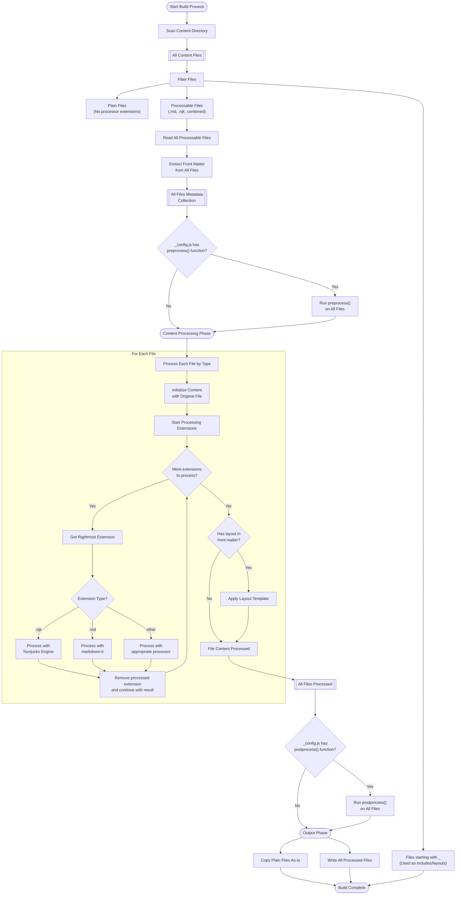

# PicoSSG Processing Flow

This diagram shows how PicoSSG processes files from source to output, including the handling of different file types and processing steps.

## Understanding the Flow

PicoSSG processes all files in distinct phases, where each phase operates on the entire collection of files:

1. **File Collection and Filtering**
   - All files in the content directory are scanned
   - Files starting with underscore (`_`) are identified for use as includes/layouts
   - Files are categorized as either plain files or processable files

2. **Metadata Collection**
   - All processable files are read in one pass
   - Front matter (YAML between `---` markers) is extracted from each file
   - A complete metadata collection is built for the entire site

3. **Preprocessing (Optional)**
   - If `_config.js` provides a `preprocess()` function:
     - It runs on all files at once
     - Has access to the complete metadata collection
     - Can modify file content and metadata before processing

4. **Content Processing**
   - Each file is processed in a loop that handles extensions one at a time:
     - Processing starts with the original file content
     - The rightmost extension is processed first, then removed
     - This continues until no more known extensions remain
     - Example: For `file.html.md.njk`:
       1. Process with Nunjucks (.njk)
       2. Process result with markdown-it (.md)
       3. Final result is an HTML file
   - After all extensions are processed, layouts are applied if specified in front matter

5. **Postprocessing (Optional)**
   - If `_config.js` provides a `postprocess()` function:
     - It runs on all processed files at once
     - Can perform site-wide modifications before output
     - Useful for minification or other transformations

6. **File Output**
   - Plain files are copied as-is to the output directory
   - Processed files are written with processor extensions removed
   - Original directory structure is preserved

This phase-based approach gives PicoSSG the ability to handle relationships between files (through the metadata collection) while maintaining the predictable 1:1 mapping from source to output files. The pre/post processing functions provide powerful extension points for site-wide transformations.