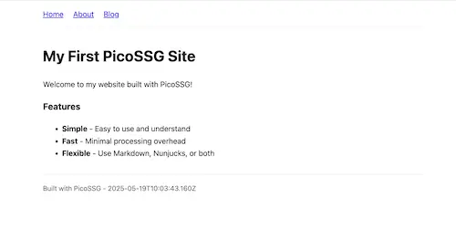

# Create a Site

This guide will walk you through creating a simple website with PicoSSG. By the end, you'll have a functional site with multiple pages, templates, and styling.

## New Project

First, let's create a new project and set up PicoSSG:

```bash-allow2copy
# Create a project directory
mkdir my-picossg-site
cd my-picossg-site

# Create basic structure
mkdir -p content

# Initialize npm project
npm init -y

# Add scripts to package.json
```

Edit your `package.json` to include these scripts:

```json-allow2copy
{
  "name": "my-picossg-site",
  "version": "1.0.0",
  "scripts": {
    "build": "npx @wolframkriesing/picossg -c content -o output",
    "start": "npx http-server output -p 0",
    "build:watch": "npx nodemon --quiet --legacy-watch --watch content --ext '*' --exec \"bash -c 'npm run build'\""
  }
}
```

## First Page

Let's create a simple homepage. Create a file at `content/index.html.md`:

```markdown-allow2copy
# My First PicoSSG Site

Welcome to my website built with PicoSSG!

### Features

- **Simple** - Easy to use and understand
- **Fast** - Minimal processing overhead
- **Flexible** - Use Markdown, Nunjucks, or both
```

**Important**: Notice that we're using `.html.md` as the extension, not just `.md`. PicoSSG only removes the 
processed extensions (like `.md` and `.njk`) but doesn't replace them, so you need to include the final extension you want (`.html` in this case).

Run `npm run build` once to build the site, then `npm start` to serve it (usually at http://localhost:8080, 
but check the terminal output — `-p 0` picks a free port).  
Stop the server with Ctrl+C.
Use `npm run build:watch` to rebuild on changes, and `npm start` in another terminal to serve while watching.

## Create a Layout

Let's create a layout template to apply consistent styling to all pages. Create `content/_base.njk`:

```html-allow2copy
<!DOCTYPE html>
<html lang="en">
<head>
  <meta charset="UTF-8">
  <meta name="viewport" content="width=device-width, initial-scale=1.0">
  <title>{{ title }} - My PicoSSG Site</title>
  <style>
    body {
      font-family: system-ui, sans-serif;
      line-height: 1.6;
      max-width: 800px;
      margin: 0 auto;
      padding: 1rem;
    }
    nav {
      margin-bottom: 2rem;
      padding-bottom: 1rem;
      border-bottom: 1px solid #eee;
    }
    nav a {
      margin-right: 1rem;
    }
    footer {
      margin-top: 2rem;
      padding-top: 1rem;
      border-top: 1px solid #eee;
      font-size: 0.9rem;
      color: #666;
    }
  </style>
</head>
<body>
  <nav>
    <a href="/">Home</a>
    <a href="/about/">About</a>
    <a href="/blog/">Blog</a>
  </nav>
  
  <main>
    {{ content | safe }}
  </main>
  
  <footer>
    Built with PicoSSG - {{ date }}
  </footer>
</body>
</html>
```

NOTE: The `{{ content | safe }}` line is where the processed content of your page will be inserted. 
The `| safe` filter tells Nunjucks to render the HTML without escaping it, it is safe to render as is.

## Front Matter Header

Now modify your `content/index.html.md` to use the layout:

```markdown-allow2copy
---
layout: _base.njk
title: Home
---

# My First PicoSSG Site

Welcome to my website built with PicoSSG!

### Features

- **Simple** - Easy to use and understand
- **Fast** - Minimal processing overhead
- **Flexible** - Use Markdown, Nunjucks, or both
```

The `layout: _base.njk` line tells PicoSSG to use the `_base.njk` file as the layout for this page,
which means the content of `index.html.md` will be rendered from markdown to HTML and inserted into the layout at the `{{ content | safe }}` placeholder.
The `title: Home` line sets the title for the page.

If you run `npm run build` now, you should see the following:

```bash
> npm run build

🎬 Building with config: {
    "contentDir": "content",
    "outDir": "output",
    "configFile": "_config.js"
}
⏭️ NO (valid) user functions loaded, searched at:
    /you/dir/content/_config.js
    0 user-defined njk filters loaded: 

⚙️ Process index.html.md, 217 Bytes, .md👍🏾 layout: _base.njk👍🏾
✅  index.html.md => index.html 1.16 kB

⏱️ Processed 1 files in 0.01 seconds.
```

Note the `⚙️ Process index.html.md, 217 Bytes, .md👍🏾 layout: _base.njk👍🏾` line,
this indicates that the file was processed as a Markdown file and then the layout was applied to it.
And the `👍🏾` just tells it worked; otherwise you would see an error.

If you start the webserver again via `npm start` and open your browser to http://localhost:8080 (use the right port!), 
you should see the homepage with the layout applied.



## One More Page

Let's add the about page. Create the directory first `mkdir -p content/about`
and put `content/about/index.html.md` in there.

```markdown-allow2copy
---
layout: _base.njk
title: About
---

# About This Site

This is a demonstration site built with PicoSSG, the minimal static site generator.

### About Me

I'm learning to build static sites with PicoSSG because it's:

- Simple to understand
- Quick to set up
- Powerful enough for my needs
```

## Dynamic Page Data

Create a blog directory and add a post:

```bash-allow2copy
mkdir -p content/blog
```

Create `content/blog/index.html.md`:

```markdown-allow2copy
---
layout: _base.njk
title: Blog
---

# Blog

Latest articles:

- [My First Post](/blog/first-post/)
```

Create `content/blog/first-post/index.html.md.njk`, notice the file ending in `.njk` which
allows us to write `{{ date }}` into the template to render the date into the file *before**
the markdown will be processed. Also the `{{ title }}` is rendering using the nunjucks template engine.

```markdown-allow2copy
---
layout: _base.njk
title: My First Blog Post
date: 1st May 2025
---

# {{ title }}

This is my first blog post using PicoSSG.

The date of this post ({{ date }}) is specified in the front matter!
```

## Build the Site

Run these commands:

```bash-allow2copy
# Start the build process with auto-rebuilding
npm run build:watch

# In a separate terminal, start the server
npm start
```

Open your browser to http://localhost:8000 to see your site!

## What's Next?

You now have a basic site with:

- Multiple pages with a shared layout
- Markdown content with front matter
- Navigation between pages
- Simple styling

## Next Steps

To continue learning PicoSSG, explore:

- [File Mapping](/docs/file-mapping/) - Understand how PicoSSG processes files
- [Front Matter](/docs/frontmatter/) - Add metadata to your pages
- [Templates](/docs/templates/) - Unleash the power of Nunjucks templating
- [Components](/docs/components/) - Build reusable components
- [Custom Filters](/docs/custom-filters/) - Extend Nunjucks with custom filters